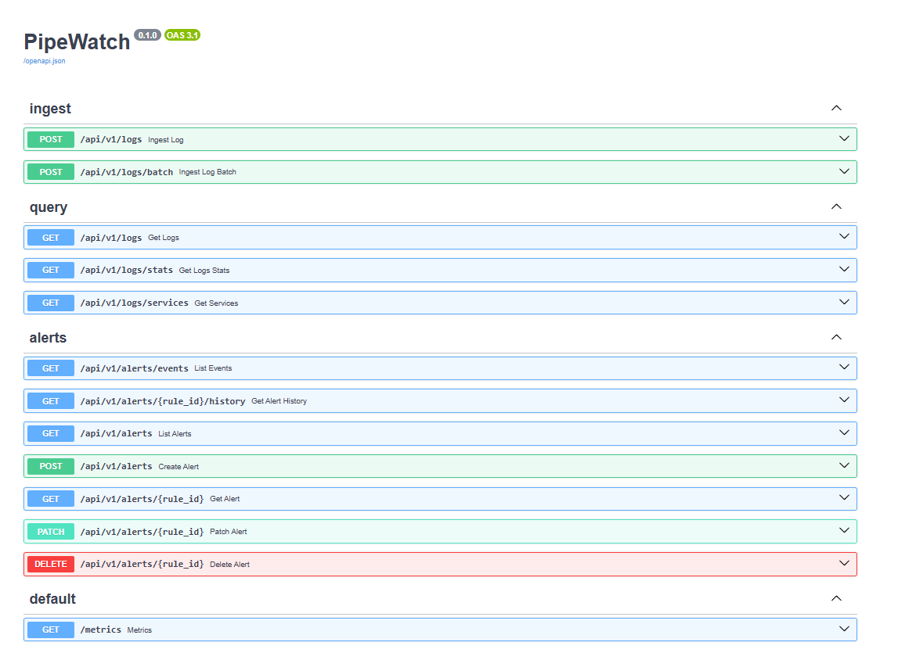
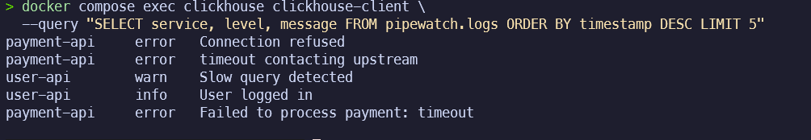
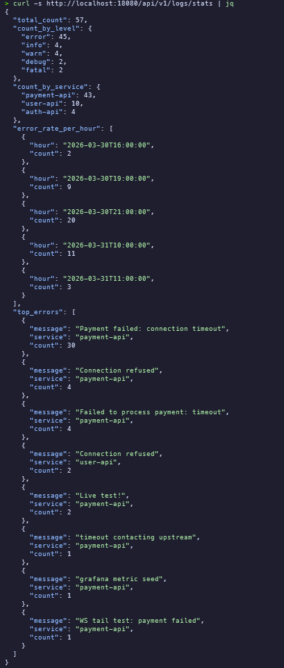
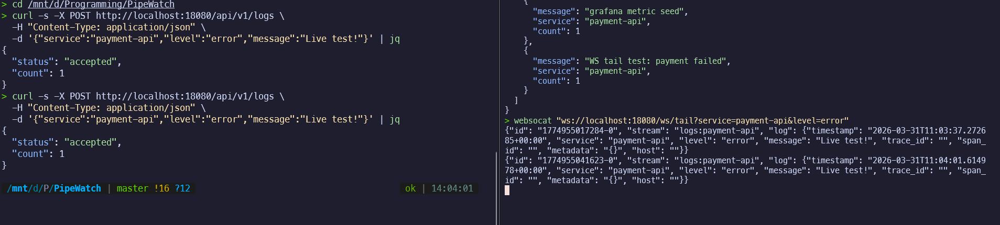
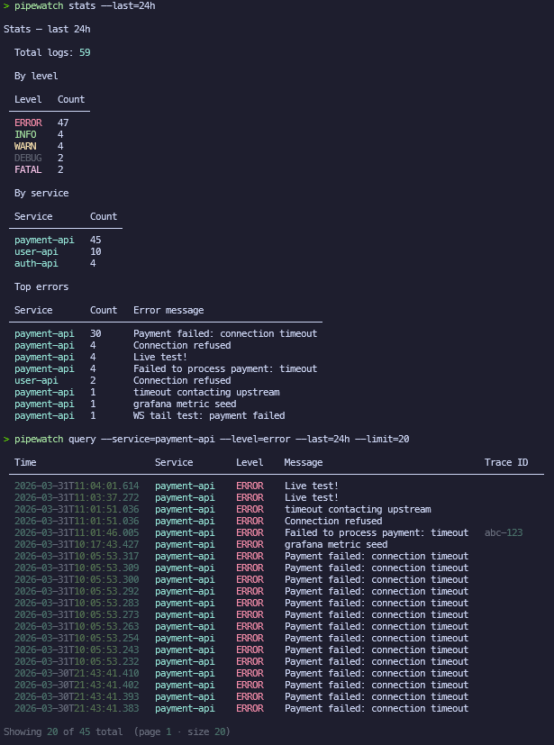
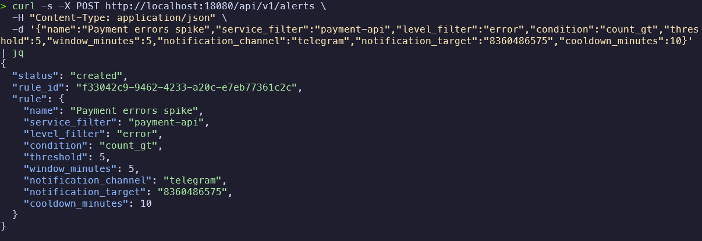
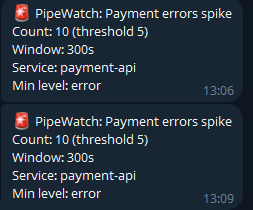
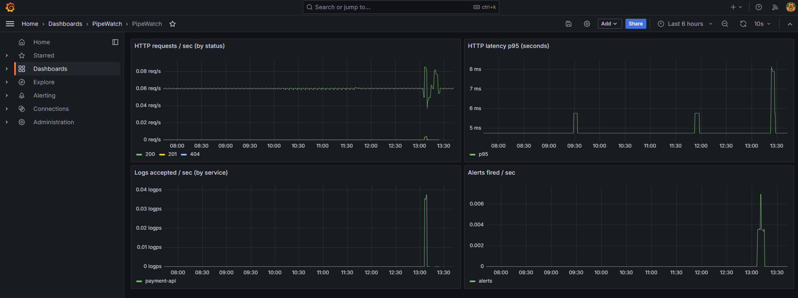
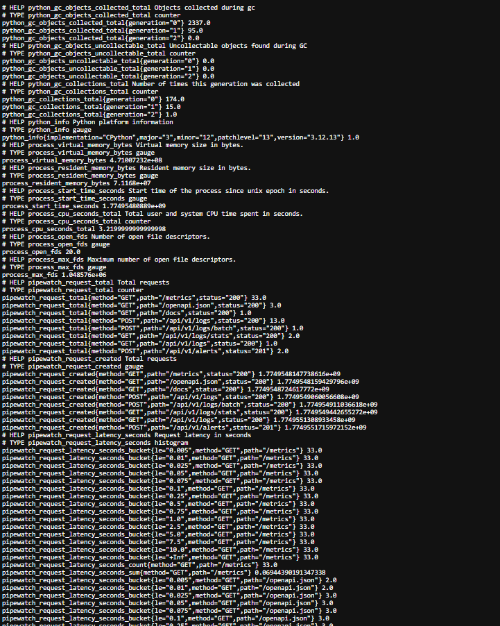
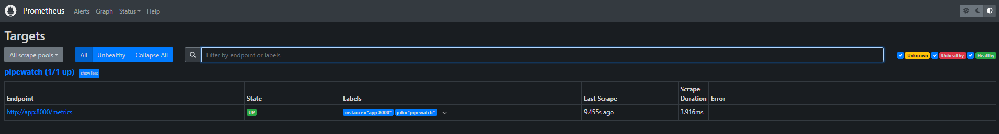

# PipeWatch

[](https://github.com/sayomiyori/PipeWatch/actions)
[](#)
[](#)
[](#)
[](#)
[](#)
[](#)
[](LICENSE)

Real-time log aggregator: **FastAPI → ClickHouse** (MergeTree, TTL, bloom filter indexes), **Redis Streams** for WebSocket live tail, **alert engine** with Telegram notifications, **CLI client** (Click + Rich), **Prometheus + Grafana** monitoring.

## Architecture

```
┌────────────┐     ┌──────────────┐     ┌─────────────┐
│ Your apps  │────▶│ PipeWatch    │────▶│ ClickHouse  │
│ (HTTP)     │     │ Ingest API   │     │ MergeTree   │
└────────────┘     └──────┬───────┘     │ TTL 30d     │
                          │             └─────────────┘
               ┌──────────┼──────────┐
               ▼          ▼          ▼
         ┌──────────┐ ┌────────┐ ┌──────────┐
         │ Redis    │ │ Alert  │ │ WS Live  │
         │ Streams  │ │ Engine │ │ Tail     │
         └──────────┘ └────┬───┘ └──────────┘
                           │
                    Telegram / HTTP callback
```

## Screenshots

### Swagger UI


### ClickHouse — stored logs


### Stats API response


### WebSocket Live Tail


### CLI output


### Alert Rules


### Telegram Alert


### Grafana Dashboards


### Prometheus Metrics


### Prometheus Targets


### Docker Services


## Tech Stack

| Component | Technology |
|-----------|-----------|
| API | FastAPI (asyncio) |
| Log storage | ClickHouse (MergeTree, TTL 30d, bloom filter indexes) |
| Live streaming | Redis Streams + WebSocket |
| Alert engine | Async periodic evaluation (30s), ClickHouse COUNT queries |
| Notifications | Telegram Bot API, HTTP callback |
| CLI | Click + Rich + websockets |
| Metrics | Prometheus + Grafana |
| CI | GitHub Actions (ruff + pytest + Docker build) |

## Architecture Decisions

**ClickHouse over PostgreSQL/Elasticsearch** — log data is append-only, high-volume, and queried by time range + filters. ClickHouse's columnar storage with MergeTree engine handles millions of rows with sub-second aggregation. TTL auto-deletes old data. Bloom filter index on `trace_id` for efficient trace lookup.

**Redis Streams over Kafka for live tail** — live tail is a fan-out to connected WebSocket clients, not a durable message queue. Redis Streams gives exactly the right semantics: ordered, real-time, lightweight. No need for consumer groups or offset management here.

**Alert engine inside the app (not Celery)** — alert evaluation is a lightweight ClickHouse COUNT query every 30 seconds. No need for a separate worker process. asyncio background task keeps it simple and reduces infrastructure.

**CLI over web dashboard** — backend developers live in the terminal. `pipewatch tail --service=api --level=error` is faster than opening a browser. Rich library gives colored output and tables without a frontend.

## Quick Start

```bash
docker compose up -d --build
```

| Service | Port | Notes |
|---------|------|-------|
| API | `18080` | Base URL |
| ClickHouse | `18123` (HTTP), `19000` (native) | |
| Redis | `16379` | |
| Prometheus | `19090` | UI |
| Grafana | `13000` | admin / admin |

### Send a log

```bash
curl -s -X POST http://localhost:18080/api/v1/logs \
  -H "Content-Type: application/json" \
  -d '{"service":"payment-api","level":"error","message":"Connection timeout","trace_id":"abc-123"}' | jq
```

### Query logs

```bash
curl -s "http://localhost:18080/api/v1/logs?service=payment-api&level=error&size=5" | jq
```

### Stats

```bash
curl -s http://localhost:18080/api/v1/logs/stats | jq
```

## API

### Ingest

| Method | Path | Description |
|--------|------|-------------|
| `POST` | `/api/v1/logs` | Ingest single log entry |
| `POST` | `/api/v1/logs/batch` | Ingest batch of log entries |

### Query

| Method | Path | Description |
|--------|------|-------------|
| `GET` | `/api/v1/logs` | Search logs (filters: `service`, `level`, `q`, `from`, `to`, `trace_id`, `page`, `size`) |
| `GET` | `/api/v1/logs/stats` | Aggregated stats: count by level, by service, error rate, top errors |
| `GET` | `/api/v1/logs/services` | Unique services with last seen |

### Live Tail

| Method | Path | Description |
|--------|------|-------------|
| `WS` | `/ws/tail` | WebSocket live log stream (params: `service`, `level`) |

### Alerts

| Method | Path | Description |
|--------|------|-------------|
| `POST` | `/api/v1/alerts` | Create alert rule |
| `GET` | `/api/v1/alerts` | List rules |
| `GET` | `/api/v1/alerts/{id}` | Get rule |
| `PATCH` | `/api/v1/alerts/{id}` | Update rule |
| `DELETE` | `/api/v1/alerts/{id}` | Delete rule |
| `GET` | `/api/v1/alerts/events` | Recent alert events |

### Metrics

| Method | Path | Description |
|--------|------|-------------|
| `GET` | `/metrics` | Prometheus text exposition |

## Prometheus Metrics

| Metric | Type | Description |
|--------|------|-------------|
| `pipewatch_logs_ingested_total` | Counter | Ingested logs; labels: `service`, `level` |
| `pipewatch_ingest_duration_seconds` | Histogram | Ingest request latency |
| `pipewatch_query_duration_seconds` | Histogram | ClickHouse query latency |
| `pipewatch_alerts_fired_total` | Counter | Alerts fired; labels: `rule_name` |
| `pipewatch_alerts_active_rules` | Gauge | Active alert rules count |
| `pipewatch_live_tail_connections` | Gauge | Active WebSocket connections |

## CLI

```bash
pip install -e cli/
export PIPEWATCH_BASE_URL=http://localhost:18080

# Live tail with filters
pipewatch tail --service=payment-api --level=error

# Query logs
pipewatch query --service=payment-api --level=error --last=1h --limit=20

# Aggregated stats
pipewatch stats --last=24h

# Alert rules
pipewatch alerts list
```

## Environment Variables

| Variable | Default | Description |
|----------|---------|-------------|
| `CLICKHOUSE_*` | see config | ClickHouse connection |
| `REDIS_*` | see config | Redis for streams |
| `ALERT_EVAL_INTERVAL_SECONDS` | 30 | Alert engine tick |
| `ALERT_COOLDOWN_SECONDS` | 300 | Min seconds between fires per rule |
| `TELEGRAM_BOT_TOKEN` | — | Telegram Bot API token |
| `TELEGRAM_CHAT_ID` | — | Default Telegram chat ID |
| `METRICS_ENABLED` | true | Enable `/metrics` |
| `PIPEWATCH_BASE_URL` | — | CLI default base URL |

## Running Tests

```bash
pip install -r requirements.txt
ruff check app cli tests
pytest -q
```

## Project Structure

```
pipewatch/
├── app/
│   ├── api/v1/          # ingest, query, alerts endpoints
│   ├── services/        # clickhouse, stream, alert_engine
│   ├── ws/              # WebSocket live tail
│   └── metrics.py       # Prometheus metrics
├── cli/                 # Click CLI: tail, query, stats, alerts
├── monitoring/          # Prometheus + Grafana configs
├── docs/images/         # Screenshots
├── docker-compose.yml
├── Dockerfile
└── requirements.txt
```

## License

MIT
